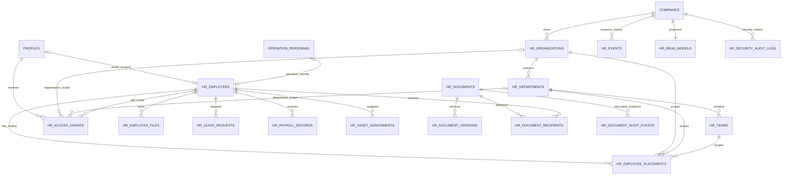
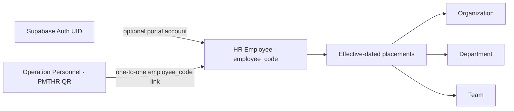
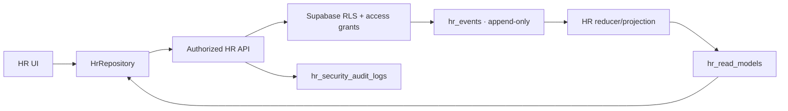

# AL METHER HR Domain Diagram

This diagram is the shared HR reference for future Studio and AI modules. `employee_code` is the stable domain identity. Auth accounts and operation records are integrations, not duplicate people.

## Identity boundaries

## Write and read flow

`hr_events` is business history. `hr_security_audit_logs` records access/security outcomes and never substitutes for the event stream.
